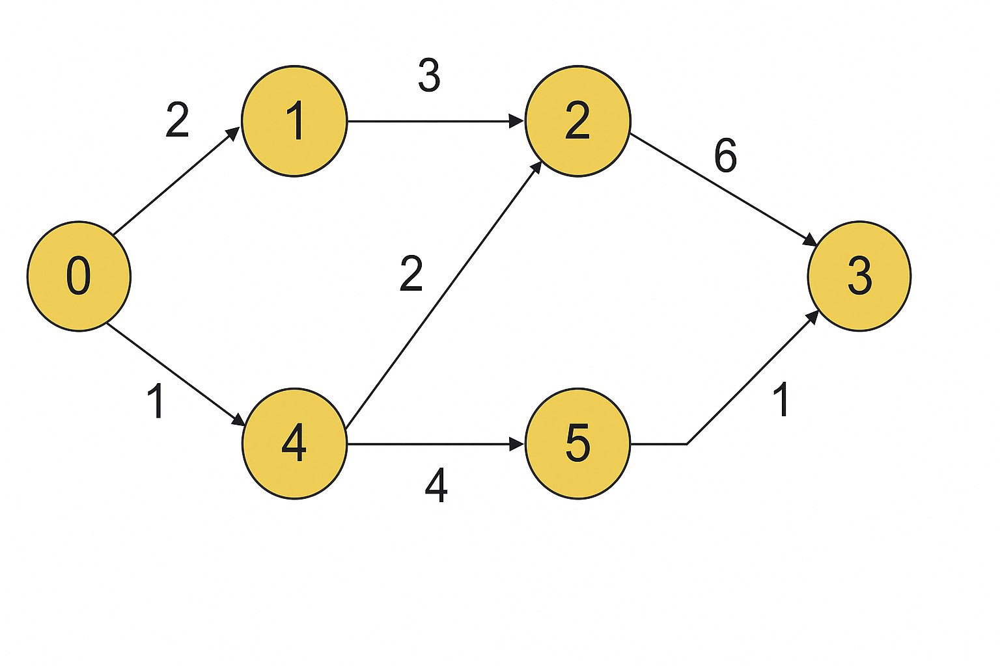
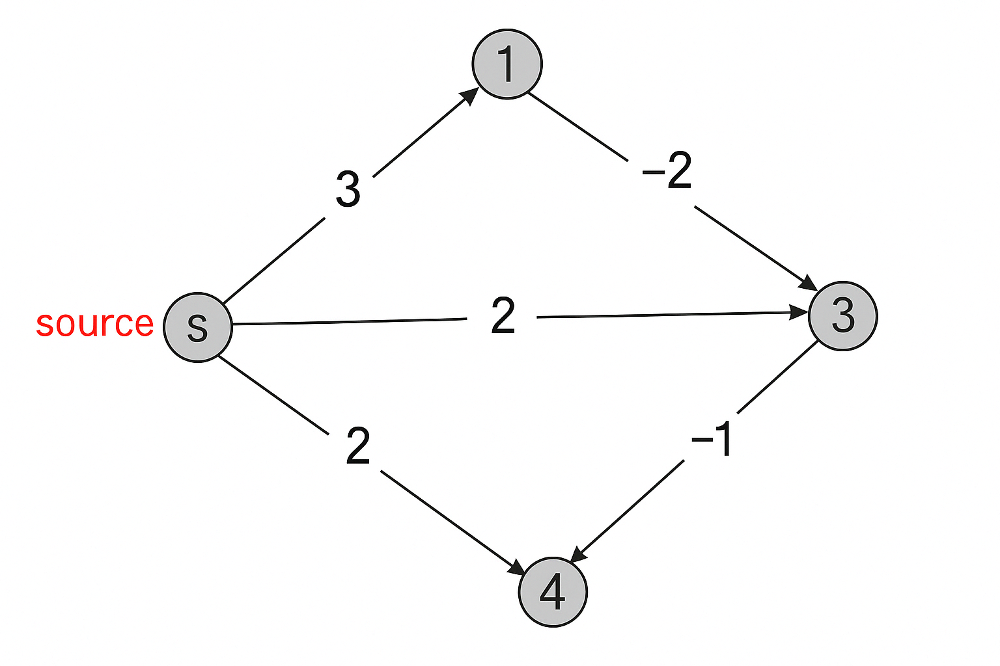

# INFO6205_ProgramStructure_Algorithms

# Table of Contents

- [INFO6205_ProgramStructure_Algorithms](#info6205_programstructure_algorithms)
  - [Lecture 1](#lecture-1)
    - [Course Overview](#course-overview)
    - [Array](#array)
    - [Linked List](#linked-list)
    - [LaTeX Overview](#latex-overview)

  - [Lecture 2](#lecture-2)
    - [Stacks (LIFO – Last In, First Out)](#stacks-lifo--last-in-first-out)
    - [Queues (FIFO – First In, First Out)](#queues-fifo--first-in-first-out)
    - [Asymptotic Analysis (Big-O Notation)](#asymptotic-analysis-big-o-notation)
      - [O-notations Example](#o-notations-example)
      - [Ω-notations Example](#ω-notations-example)
      - [Θ-notations Example](#θ-notations-example)
    - [Sorting Algorithms](#sorting-algorithms)
    - [Insertion Sort](#insertion-sort)

  - [Lecture 3](#lecture-3)
    - [Quicksort (Divide and Conquer Sorting Algorithm)](#quicksort-divide-and-conquer-sorting-algorithm)
    - [Counting Sort (O(n))](#counting-sort-on)
    - [Radix Sort (O(nk))](#radix-sort-onk)
    - [Recurrence](#recurrence)
    - [Substitution Method](#substitution-method)
    - [Recursion Trees Method](#recursion-trees-method)
    - [Master Method](#master-method)
      - [Master Method Example Case 1](#master-method-example-case-1)
      - [Master Method Example Case 2](#master-method-example-case-2)
      - [Master Method Example Case 3](#master-method-example-case-3)
    - [Divide & Conquer (D-Q)](#divide--conquer-d-q)
    - [Binary Search (O(log n))](#binary-search-olog-n)

  - [Lecture 4](#lecture-4)
    - [Divide and Conquer](#divide-and-conquer)
    - [Binary Search](#binary-search)
    - [Merge Sort](#merge-sort)
    - [Find Majority Element](#find-majority-element)
    - [Find the Index of First “1” in a Sorted Binary Array](#find-the-index-of-first-1-in-a-sorted-binary-array)

  - [Lecture 5](#lecture-5)
    - [Graph Definition](#graph-definition)
    - [Graph Representations](#graph-representations)
      - [Adjacency Matrix](#1-adjacency-matrix-good-for-dense-graphs-but-uses-more-space)
      - [Adjacency List](#2-adjacency-list-best-for-most-cases)
      - [Edge List](#3-edge-list-simple-but-hard-to-find-neighbors)
      - [Which One Should You Use?](#which-one-should-you-use)
    - [Explore](#explore)
    - [Depth-First Search (DFS)](#depth-first-search)
      - [DFS Pseudocode](#pseudocode-for-dfs)
      - [DFS Runtime](#runtime-of-dfs)
    - [Connected Components](#connected-components)
    - [Pre- and Post- Orders in DFS](#pre--and-post--orders-in-dfs)
    - [Edge Classification in Directed Graphs](#edge-classification-in-directed-graphs)
    - [Directed Graphs and Directed Acyclic Graphs (DAGs)](#directed-graphs-and-directed-acyclic-graphs-dags)
      - [Topological Ordering and DAGs](#topological-ordering-and-dags)

  - [Lecture 6](#lecture-6)
    - [Strongly Connected Components (SCCs)](#strongly-connected-components)
    - [Metagraph](#metagraph)
    - [Algorithm to Compute SCCs](#algorithm-to-compute-sccs)
    - [Breadth-First Search (BFS)](#breadth-first-search-bfs)
      - [BFS Algorithm](#bfs-algorithm)
      - [Time Complexity](#time-complexity)
    - [Tree Data Structures](#tree-data-structures)
    - [Binary Trees & Traversals](#binary-trees--traversals)

  - [Lecture 11](#lecture-11)

## Lecture 1

### Course Overview

- Algorithm design techniques (recursion, divide & conquer, greedy, dynamic programming)
- Data structures (arrays, linked lists, stacks, queues)
- Algorithm analysis (correctness, complexity)

### Array

NumPy Arrays Example
```
import numpy as np

arr1D = np.array([1, 2, 3, 4, 5])
print(arr1D)

arr2D = np.array([[1, 2, 3], [4, 5, 6]])
print(arr2D)

# Accessing elements
print(arr2D[1, -1])  # Last element of the second row
```

NumPy Slicing and Reshaping
```
# Slicing: [start:end:step]
print(arr1D[1:5:2])  # Every other element from index 1 to 5
print(arr1D[::2])    # Every other element from entire array

# Reshaping: Convert 1D to 2D
arr = np.array([1,2,3,4,5,6,7,8,9,10,11,12])
newarr2D = arr.reshape(4,3)  # Converts into 4 rows & 3 columns
print(newarr2D)
```

Advantages of Arrays<br>
- ✔ Constant time access (O(1)) due to direct indexing.
- ✔ Efficient memory usage (contiguous storage, good cache locality).
- ✔ Supported in all programming languages (widely used).
- ✔ Simple and easy to use compared to other data structures.
- ✔ Supports multi-dimensional structures (2D, 3D arrays).


Disadvantages of Arrays<br>
- ✖ Fixed size – cannot grow dynamically like linked lists.
- ✖ Insertion and deletion are costly (O(n)) due to shifting elements.
- ✖ Only supports one data type – lacks flexibility.

### Linked List

```
class Node:
    def __init__(self, data):
        self.data = data
        self.next = None

class LinkedList:
    def __init__(self):
        self.head = None

    def insert(self, data):
        new_node = Node(data)
        new_node.next = self.head
        self.head = new_node

    def print_list(self):
        temp = self.head
        while temp:
            print(temp.data, end=" -> ")
            temp = temp.next
        print("NULL")

ll = LinkedList()
ll.insert(10)
ll.insert(20)
ll.insert(30)
ll.print_list()
```

Advantages of Linked Lists<br>
- ✔ Dynamic sizing – can grow/shrink as needed.
- ✔ Efficient insertions and deletions – no need to shift elements.
- ✔ More flexible memory allocation – does not require contiguous memory like arrays.

Disadvantages of Linked Lists<br>
- ✖ Extra memory for pointers – each node requires storage for links.
- ✖ Sequential access (O(n)) – no direct indexing like arrays (O(1)).
- ✖ More complex implementation due to pointer management.

### LaTeX Overview

Basic Document Structure
```
\documentclass{article} % Specifies the type of document (e.g., article, report, book)
\usepackage{amsmath}    % Include extra features like advanced math formatting
\begin{document}        % Start of the document content

Hello, World!           % Your content goes here

\end{document}          % End of the document
```

Sections and Subsections
```
\section{Section Title}
\subsection{Subsection Title}
\subsubsection{Sub-subsection Title}
```

Mathematical Equations
```
\[
a^2 + b^2 = c^2
\]
```

Lists (Bulleted & Numbered)
```
\begin{itemize}
  \item First item
  \item Second item
\end{itemize}

\begin{enumerate}
  \item First item
  \item Second item
\end{enumerate}
```

Tables
```
\begin{tabular}{|c|c|c|}
\hline
Header 1 & Header 2 & Header 3 \\ \hline
Cell 1   & Cell 2   & Cell 3   \\ \hline
Cell 4   & Cell 5   & Cell 6   \\ \hline
\end{tabular}
```

Adding Images
```
\usepackage{graphicx}

\begin{figure}[h]
\centering
\includegraphics[width=0.5\textwidth]{image.jpg} % Adjust width as needed
\caption{A sample image}
\end{figure}
```

## Lecture 2

### Stacks (LIFO – Last In, First Out)

| Operation  | Time Complexity |
|------------|----------------|
| **Push(item)** – Add element | `O(1)` (without resizing) |
| **Pop()** – Remove top element | `O(1)` |
| **Peek()** – Get top element without removing | `O(1)` |
| **Size()** – Get number of elements | `O(1)` |
| **IsEmpty()** – Check if stack is empty | `O(1)` |

Stack Applications<br>
- **Depth-First Search (DFS)** in graphs
- **Tree Traversals** (Recursion uses an implicit stack)
- **Undo functionality** in text editors
- **Reversing a string**

### Queues (FIFO – First In, First Out)

| Operation  | Time Complexity |
|------------|----------------|
| **Enqueue(item)** – Add element at end | `O(1)` (without resizing) |
| **Dequeue()** – Remove front element | `O(1)` |
| **Peek()** – Get front element without removing | `O(1)` |
| **Size()** – Get number of elements | `O(1)` |
| **IsEmpty()** – Check if queue is empty | `O(1)` |

Queue Applications<br>
- **Task scheduling** in operating systems (OS)
- **Managing network packets** (TCP/IP, routers)
- **Breadth-First Search (BFS)** in graphs
- **Preorder traversal** in trees (flattening a tree)

### Asymptotic Analysis (Big-O Notation)
- **Measures how an algorithm's running time grows with input size `n`**.
- Focuses on the **leading term** (ignores constants and lower-order terms).
- **Three types of asymptotic bounds**:
  - **Big-O (`O`)** → Upper bound (worst case).
  - **Big-Omega (`Ω`)** → Lower bound (best case).
  - **Big-Theta (`Θ`)** → Tight bound (both upper and lower).

#### O-notations Example

What is `O` for `f(n) = n² + 2n + 1`?<br>

Let `g(n) = n²`,<br>
We need to find constants `c` and `n₀` such that:<br>
`f(n) ≤ c * g(n) for all n > n₀`<br>
which is `n² + 2n + 1 ≤ c * n²`<br>
Since `n² + 2n + 1 ≤ n² + 2n² + n²` for all `n > 1`<br>
We can get `n² + 2n + 1 ≤ 4n²` for all `n > 1`<br>
Therefore, `n₀ = 1` and `c = 4`<br>
`f(n)` grows as `O(n²)`<br>

#### Ω-notations Example

What is `Ω` for `f(n) = log(n⁴) + 2ⁿ`?<br>

Let `g(n) = log(n)`,<br>
We need to find constants `c` and `n₀` such that:<br>
`f(n) ≥ c * g(n) for all n > n₀`<br>
which is `log(n⁴) + 2ⁿ ≥ c * log(n)`<br>
Since `log(n⁴) + 2ⁿ = 4log(n) + 2ⁿ`<br>
and `4log(n) + 2ⁿ ≥ c * log(n)` for all `n > 1`<br>
We can choose `c = 1` and `n₀ = 1`<br>
Therefore, `f(n)` is lower-bounded as `Ω(log(n))`<br>

#### Θ-notations Example

What is `Θ` for `f(n) = n² + 5n log n`?<br>

Let `g(n) = n²`,<br>
We need to find constants `c₁`, `c₂`, and `n₀` such that:<br>
`c₁ * g(n) ≤ f(n) ≤ c₂ * g(n) for all n > n₀`<br>

For the **upper bound (Big-O)**:<br>
Since `5n log n ≤ 5n²` for all `n > 1`, choosing `c₂ = 6` gives:<br>
`n² + 5n log n ≤ 6n²` for all `n > 1`<br>
Thus, `f(n)` is **upper-bounded by `O(n²)`**.<br>

For the **lower bound (Big-Omega)**:<br>
Since `n² + 5n log n ≥ n²` for all `n > 1`, choosing `c₁ = 1` gives:<br>
`n² + 5n log n ≥ n²` for all `n > 1`<br>
Thus, `f(n)` is **lower-bounded by `Ω(n²)`**.<br>

Therefore, `n₀ = 1`, and `f(n) ∈ Θ(n²)`.<br>

### Sorting Algorithms

The Sorting Problem<br>
- Input: Sequence of n numbers.
- Output: Reordering of numbers into increasing order.

Comparison-based sorting:<br>
- Insertion Sort
- Quicksort
- Heapsort
- Merge Sort

Non-comparison-based sorting:<br>
- Counting Sort
- Radix Sort

### Insertion Sort

Algorithm:<br>
- Assume the first j-1 elements are sorted.
- Insert A[j] into the correct position.

```
def insertion_sort(A):
    for j in range(1, len(A)):
        key = A[j]
        i = j - 1
        while i >= 0 and A[i] > key:
            A[i + 1] = A[i]
            i -= 1
        A[i + 1] = key
```

Time Complexity:<br>

- Best Case: O(n) – when the array is already sorted.
- Average Case: O(n²) – when elements are in random order.
- Worst Case: O(n²) – when the array is sorted in reverse order.

## Lecture 3

### Quicksort (Divide and Conquer Sorting Algorithm)

```
def quickSort(arr, start, end):
    if start < end:
        pivot = end
        i = start - 1
        for j in range(start, end):
            if arr[j] <= arr[pivot]:
                i += 1
                arr[i], arr[j] = arr[j], arr[i]
        arr[i + 1], arr[pivot] = arr[pivot], arr[i + 1]
        p = i + 1
        quickSort(arr, start, p - 1)
        quickSort(arr, p + 1, end)

arr = [5, 4, 3, 2, 1]
quickSort(arr, 0, len(arr) - 1)
print(arr)  # Output: [1, 2, 3, 4, 5]
```

Time Complexity:<br>

- Best Case (O(n log n)): Pivot is near the middle.
- Average Case (O(n log n)): Randomized pivot selection.
- Worst Case (O(n²)): Pivot is always the smallest/largest (e.g., sorted/reverse sorted arrays).

### Counting Sort (O(n))

Steps:<br>
- Find the maximum value in the array.
- Create a count array initialized with zeros.
- Store occurrences of each element in the count array.
- Compute cumulative sums to determine final positions.
- Place elements into the sorted array.

### Radix Sort (O(nk))

Example:<br>
Sorting [121, 432, 564, 23, 1, 45, 788]:<br>
Sort by units digit → [1, 121, 432, 23, 564, 45, 788]<br>
Sort by tens digit → [1, 23, 121, 432, 45, 564, 788]<br>
Sort by hundreds digit → [1, 23, 45, 121, 432, 564, 788] (Sorted)<br>

### Recurrences and Solving Recurrences

Why Use Recurrences?<br>

- Many algorithms (e.g., Divide and Conquer, Dynamic Programming) use recursion, making it hard to determine their time complexity directly.
- Recurrences give a general method to analyze running time.

Solving Recurrences: <br>
- Substitution Method
- Recursion Tree Method
- Master Theorem

### Substitution Method

It works by guessing a solution and proving it using mathematical induction.<br>

#### Substitution Method Example

What is `O` for `T(n) = 2T(⌊n/2⌋) + Θ(n)`?<br>

The recurrence: `T(n)=2T(n/2)+O(n)` is very similar to Merge Sort, which we already know has complexity `O(n log n)`.<br>
So, we suspect that `T(n) = O(n log n)` might be the correct answer.<br>

Guess `T(n) = O(n log n)`,<br>
We need to prove that `T(n) ≤ c * n log n` for all `n > n₀`.<br>

Inductive Hypothesis:
Assume that `T(n) ≤ c * n log n` holds for `⌊n/2⌋`, meaning:<br>
`T(⌊n/2⌋) ≤ c ⌊n/2⌋ log ⌊n/2⌋`.<br>

Substituting into the recurrence: <br>
`T(n) = 2T(⌊n/2⌋) + Θ(n)`<br>
`≤ 2(c ⌊n/2⌋ log ⌊n/2⌋) + Θ(n)`<br>
`≤ 2(c (n/2) log(n/2)) + Θ(n)`<br>
`= c n log(n/2) + Θ(n)`<br>
`= c n (log n - log 2) + Θ(n)`<br>
`= c n log n - c n log 2 + Θ(n)`<br>
`≤ c n log n`<br>

Since `-c n log 2 + Θ(n)` is a lower-order term,<br>
we can conclude:<br>

Therefore, `T(n) = O(n log n)`.<br>

### Recursion trees Method

- Original problem: root with size n.
- Each non base node has a children with size n/b.
- By summing across each level, the recursion tree shows the cost at each level of recursion.
`Total cost = sum of all levels`
- Can be used to generate a guess. Then verify by substitution method.

#### Recursion trees Method Example

The given recurrence is:
`T(n) = 3T(n/4) + Θ(n²)`
This means:
- The problem of size `n` breaks into 3 smaller subproblems, each of size `n/4`.
- Each level does some extra work of `Θ(n²)` before calling the next level.
- This continues until the problem size reaches `1` (base case).

Step 1: Drawing the Recursion Tree<br>
- Level 0 (Root Node):
  - We start with the original problem `T(n)`, which does `Θ(n²)` work.
- Level 1:
  - The problem splits into 3 subproblems: `T(n/4)`, `T(n/4)`, `T(n/4)`.
  - Each subproblem does its own work of `Θ((n/4)²)`.
- Level 2:
  - Each `T(n/4)` now splits into 3 more subproblems of size `T(n/16)`.
  - This pattern continues until `n = 1`.

Step 2: Finding the Depth of the Tree<br>
- Since each subproblem is reduced by a factor of `4`, the number of levels is:
`log₄(n)`
- So, the tree has `log₄(n)` levels before reaching the base case `T(1) = Θ(1)`.

Step 3: Counting the Number of Leaves<br>
- Each level triples the number of nodes (because `T(n) = 3T(n/4) + Θ(n²)`).
- The total number of leaf nodes at the last level is:
`3^(log₄(n)) = n^(log₄(3))`

Step 4: Calculating the Total Work<br>
- At each level, the work done is decreasing:
`Θ(n²) + Θ((n/4)²) + Θ((n/16)²) + ... + Θ(1)`
- The total work forms a geometric series, which sums to `O(n²)`.

Final Answer<br>
- Depth of the tree: `log₄(n)`
- Number of leaves: `n^(log₄(3))`
- Total work done: `O(n²)`

### Master method

`T(n) = aT(n/b) + f(n)`

Where:<br>
- `a` is the number of recursive subproblems.
- `b` is the factor by which the problem size is reduced.
- `f(n)` is the extra work done at each level outside the recursion.

1. **Case 1** (`f(n)` grows slower than `n^(log_b(a))`):<br>
`f(n) = O(n^(log_b(a) - ε)), where ε > 0`<br>
=>  `T(n) = Θ(n^(log_b(a)))`<br>

2. **Case 2** (`f(n)` grows at the same rate as `n^(log_b(a))`):<br>
`f(n) = Θ(n^(log_b(a)) log^k(n)), where k ≥ 0`<br>
=>  `T(n) = Θ(n^(log_b(a)) log^(k+1)(n))`<br>


3. **Case 3** (`f(n)` grows faster than `n^(log_b(a))`):<br>
`f(n) = Ω(n^(log_b(a) + ε)), where ε > 0`<br>
=>  `T(n) = Θ(f(n))`<br>

#### Master method Example Case 1

`T(n) = 5T(n/2) + Θ(n²)`

Using the Master Theorem for recurrences of the form:<br>

`T(n) = aT(n/b) + f(n)`

where:
- `a = 5` (5 subproblems)
- `b = 2` (each subproblem size is `n/2`)
- `f(n) = Θ(n²)`

We calculate:<br>

`log₂(5) ≈ 2.32`, so `n^(log₂(5)) ≈ n^2.32`.<br>

We try case 1 in here, which mean that `Θ(n²) <= O(n^(log_b(a) - ε))`<br>
For some constant `c > 0`:<br>
`cn² <= c(n^(log_b(a) - ε))`<br>
So we need to find `n² <= n^(log_b(a) - ε)` where `ε > 0`<br>

Comparing `f(n) = Θ(n²)` with `n^(log₂(5)) = Θ(n^2.32)`, we see that `n²` grows slower than `n^2.32`, meaning `log₂(5 - ϵ) >= 2` for `ϵ <= 1`.<br>

Since `f(n) = O(n^(log_b(a) - ϵ))`, we use Case 1 of the Master Theorem:<br>

`T(n) = Θ(n^(log_b(a)))`<br>

Final result:<br>

`T(n) = Θ(n^(lg 5))`<br>

#### Master method Example Case 2

`T(n) = 27T(n/3) + Θ(n³ log n)`

Using the Master Theorem for recurrences of the form:<br>

`T(n) = aT(n/b) + f(n)`

where:
- `a = 27` (27 subproblems)
- `b = 3` (each subproblem size is `n/3`)
- `f(n) = Θ(n³ log n)`

We calculate:<br>

`log₃(27) = 3`, so `n^(log₃(27)) = n³`.<br>

We try case 2 here, which means that `f(n) = Θ(n^(log_b(a)) log^k n)`<br>
For some constant `c > 0`:<br>
`cn³ log n = c(n^(log_b(a)) log^k n)`<br>

Comparing `f(n) = Θ(n³ log n)` with `n^(log₃(27)) = Θ(n³)`, we see that `f(n)` has an extra `log n` factor, meaning `k = 1`.<br>

Since `f(n) = Θ(n^(log_b(a)) log^k n)`, we use Case 2 of the Master Theorem:<br>

`T(n) = Θ(n^(log_b(a)) log^(k+1) n)`<br>

Final result:<br>

`T(n) = Θ(n³ log² n)`<br>

#### Master method Example Case 3

`T(n) = 5T(n/2) + Θ(n³)`

Using the Master Theorem for recurrences of the form:<br>

`T(n) = aT(n/b) + f(n)`

where:
- `a = 5` (5 subproblems)
- `b = 2` (each subproblem size is `n/2`)
- `f(n) = Θ(n³)`

We calculate:<br>

`log₂(5) ≈ 2.32`, so `n^(log₂(5)) ≈ n^2.32`.<br>

We try case 3 here, which means that `f(n) = Ω(n^(log_b(a) + ε))` for some `ε > 0`.<br>
For some constant `c > 0`:<br>
`n³ ≥ c n^(log_b(a) + ε)`<br>

Since `log₂(5) + ε = 3` for some `ε > 0`, we check the **regularity condition**:<br>

`a f(n/b) = 5(n/2)³ = 5n³/8 ≤ c n³` for `c = 5/8 < 1`.<br>

Since the condition holds, we use **Case 3** of the Master Theorem:<br>

`T(n) = Θ(f(n))`<br>

Final result:<br>

`T(n) = Θ(n³)`<br>

### Divide & Conquer (D-Q)

**Divide & Conquer** is a problem-solving approach that involves breaking a problem into smaller subproblems, solving them recursively, and combining the solutions.

#### Steps:
1. **Divide**: Split the problem into smaller subproblems.
2. **Conquer**: Solve each subproblem recursively.
3. **Combine**: Merge the solutions to solve the original problem.

#### Examples:
- **Merge Sort**: Recursively divides an array into halves, sorts them, and merges the sorted halves.
- **QuickSort**: Selects a pivot, partitions the array into smaller and larger elements, and sorts recursively.
- **Binary Search**: Recursively searches for an element by halving the search space.

### Binary Search (`O(log n)`)

Binary Search is an efficient way to find an element in a **sorted array** by repeatedly halving the search space.

#### Steps:
1. Find the **middle element** of the array.
2. If it matches the target, return its index.
3. If the target is **smaller**, search in the **left half**.
4. If the target is **greater**, search in the **right half**.
5. Repeat until the element is found or the search space is empty.

#### Time Complexity:
- **Best Case**: `O(1)` (if the middle element is the target).
- **Worst & Average Case**: `O(log n)` (as the search space is halved each step).

#### Example Code:
```python
def binary_search(arr, target):
    left, right = 0, len(arr) - 1
    while left <= right:
        mid = (left + right) // 2
        if arr[mid] == target:
            return mid
        elif arr[mid] < target:
            left = mid + 1
        else:
            right = mid - 1
    return -1
```

## Lecture 4

### Divide and Conquer

- Divide the problem into smaller subproblems.
- Recursively solve the subproblems.
- Combine the results to get the final solution.

#### Examples
- Binary Search
- Merge Sort
- Problems:
  - Find Majority Element
  - Find the Index of First “1” in a Sorted Binary Array

### Binary search

- Find middle element mid = lo + (hi – lo)/2
- Return𝑖if𝐴𝑚𝑖𝑑 == 𝑥
- If 𝐴 𝑚𝑖𝑑 < 𝑥, search 𝐴[𝑚𝑖𝑑 + 1: h𝑖] (subproblem)
- If 𝐴 𝑚𝑖𝑑 > 𝑥, search 𝐴[𝑙𝑜: 𝑚𝑖𝑑 − 1] (subproblem)
- Return -1 if x cannot be found in subproblem.
- Initially, lo = 1, hi = n

#### Running Time

- In each iteration, we discard one half of the subproblem.
- So, the size of each successive subproblem is halved:
  - Let, `n = 2^k`
  - Subproblem sizes:  
    `2^k → 2^(k-1) → 2^(k-2) → ... → 2^(k-k) = 1`
- In each iteration, we do a constant amount of work:
  - Either check for equality or inequality of `A[mid]` with `x`.

We can express the running time as:<br>
`T(n) = T(n/2) + O(1)`

Solving Using Master Theorem<br>
- Given:
  - `a = 1`, `b = 2`, `d = 0`, `k = 0`
  - `log a / log b = d` ⇒ **Case 2** of the Master Theorem
- Solution:
  `Θ(n^d log^(k+1) n) = Θ(log n)`

### Merge sort

Merge sort on Sequence S of N elements:<br>
➢ Divide: Divide S into disjoint subsets S1 and S2<br>
➢ Conquer: Recursively merge sort S1 and S2<br>
➢ Combine: Merge S1 and S2 into a sorted sequence<br>

```
MERGE-SORT(A, p, r):
  if p < r:
      q = (p + r) // 2  # Divide the array into two halves
      MERGE-SORT(A, p, q)  # Conquer (Sort left half)
      MERGE-SORT(A, q+1, r)  # Conquer (Sort right half)
      MERGE(A, p, q, r)  # Combine (Merge both halves)
```

#### Running Time

- Recursive tree is a **perfect binary tree**, height is `log n`.
- At each depth `k`, we need to merge `2^(k+1)` sequences of size `n / 2^(k+1)`:
  - **Work at each depth is** `θ(n)`
  - **Base case**: `T(1) = c`

Recurrence Relation:<br>
`T(n) = 2T(n/2) + θ(n) = cn + n log n = θ(n log n)`

Time Complexity:<br>
- **Best-case, Average-case, and Worst-case**:
  `θ(n log n)`

Space Complexity:<br>
- `θ(n)` for arrays
- `O(1)` for linked lists

### Find Majority Element

#### Problem Statement
- Given an array A[1:n], a majority element is any element that appears more than n/2 times.

#### Observations
- At most one majority element exists.
- If A has a majority element, it must be a majority in at least one of its halves.

#### Divide and Conquer Approach
1. Divide A into two halves: A1 and A2.
2. Recursively find the majority element in each half.
3. Merge Step:
   - If neither A1 nor A2 has a majority, return None.
   - If only A1 has a majority, count its occurrences in A to verify.
   - If only A2 has a majority, count its occurrences in A to verify.
   - If both halves have the same majority, return it.

#### Time Complexity
- Recurrence relation: T(n) = 2T(n/2) + O(n)
- Solution: O(n log n)

### Find the Index of First “1” in a Sorted Binary Array

#### Problem Statement
- Given a sorted binary array A[1:n] where all 0s appear before 1s, find the index of the first 1.

#### Brute-Force Approach
1. Scan A from 1 to n.
2. Return the first index where A[i] = 1.
3. If no 1 exists, return -1.

- Time Complexity: O(n)

#### Optimized Divide and Conquer Approach
1. Binary Search for the first 1:
   - Find mid = (lo + hi) / 2.
   - If A[mid] = 1 and A[mid-1] = 0, return mid.
   - If A[mid] = 0, search in the right half.
   - If A[mid] = 1 but A[mid-1] = 1, search in the left half.

#### Time Complexity
- Recurrence relation: T(n) = T(n/2) + O(1)
- Solution: O(log n)

## Lecture 5

### Graph Definition

A graph G = (V,E) consists of two things:<br>
- A collection V of vertices, or objects to be connected.
- A collection E of edges, each of which connects a pair of vertices.
- Degree: vertex v is the number of edges that are incident to it.

Graphs can be:<br>
- Undirected: Edges have no direction.
- Directed (Digraphs): Edges have a direction (from one vertex to another).

Examples:<br>
- The Internet as a graph: V= {websites}, E= {links between websites}.
- A Highway system: V= {intersections}, E= {roads}.

### Graph Representations

#### 1. Adjacency Matrix (Good for dense graphs but uses more space)
- Uses a table (matrix) to show connections between nodes.
- If two nodes are connected, we put 1, otherwise 0.
- Good for dense graphs (many connections).

#### Example
For this graph
```
 A --- B
 |   / |
 |  /  |
 C --- D
```
The Adjacency Matrix looks like this:

|   | A | B | C | D |
|---|---|---|---|---|
| A | 0 | 1 | 1 | 0 |
| B | 1 | 0 | 1 | 1 |
| C | 1 | 1 | 0 | 1 |
| D | 0 | 1 | 1 | 0 |

#### Pros & Cons
✅ Fast to check if two nodes are connected  
✅ Works well for graphs with many connections  
❌ Uses a lot of space (even for missing connections)  
❌ Finding neighbors is slow (need to check an entire row)  

#### 2. Adjacency List (Best for most cases)
- Each node keeps a list of neighbors.
- Uses less space than a matrix.
- Fast to find neighbors of a node.

#### Examples
For the same graph, the Adjacency List is:

`A → [B, C] B → [A, C, D] C → [A, B, D] D → [B, C]`

#### Pros & Cons
✅ Uses less space (only stores connections)  
✅ Fast to find neighbors  
❌ Checking if two nodes are connected takes longer  

#### 3. Edge List (Simple, but hard to find neighbors)
- Just a list of all connections (edges).
- Doesn't store nodes directly, just who connects to whom.

#### Example

`(A, B) (A, C) (B, C) (B, D) (C, D)`

#### Pros & Cons
✅ Takes very little space  
✅ Good for algorithms that process edges  
❌ Finding neighbors is slow (need to search the whole list)  

#### Which One Should You Use?
| Graph Type       | Best Representation |
|-----------------|--------------------|
| Many connections (Dense Graph) | Adjacency Matrix |
| Most cases (Normal Graph) | Adjacency List |
| Only care about edges | Edge List |

### Explore

Pseudocode for Explore
```
explore(v)
  v.visited ← true
  For each edge (v,w)
    If not w.visited 
      explore(w) 
      w.prev ← v
```

Python Code
```
class Graph:
    def __init__(self):
        self.adj_list = {}  # Dictionary to store adjacency list
        self.visited = {}   # Dictionary to track visited nodes

    def add_edge(self, v, w):
        """ Adds an edge to the graph (Undirected by default) """
        if v not in self.adj_list:
            self.adj_list[v] = []
        if w not in self.adj_list:
            self.adj_list[w] = []
        self.adj_list[v].append(w)
        self.adj_list[w].append(v)  # Remove this line for a directed graph

    def explore(self, v):
        """ Recursive DFS function to explore a vertex """
        self.visited[v] = True
        print(v, end=" ")  # Process node (for example, print it)

        for neighbor in self.adj_list[v]:  # Check all adjacent vertices
            if not self.visited[neighbor]:  # If not visited, explore it
                self.explore(neighbor)

# 1. Create a Graph
graph = Graph()

# 2. Add Edges (Example Graph)
edges = [
    ("A", "B"), ("A", "C"), 
    ("B", "C"), ("B", "D"),
    ("C", "D")
]

for v, w in edges:
    graph.add_edge(v, w)

# 3. Initialize visited dictionary
graph.visited = {vertex: False for vertex in graph.adj_list}

# 4. Run DFS starting from a node (e.g., "A")
print("DFS traversal starting from A:")
graph.explore("A")

# DFS traversal starting from A:
# A B C D 
```

### Depth-First Search

DFS explores as far as possible before backtracking.<br>

Used for:<br>
- Finding connected components.
- Topological sorting in DAGs.
- Cycle detection.

Pseudocode for DFS
```
DFS(G):
    for each vertex v in G:
        if v is not visited:
            explore(v)
```

Python Code
```
class Graph:
    def __init__(self):
        self.adj_list = {}  # Dictionary to store adjacency list
        self.visited = {}   # Dictionary to track visited nodes

    def add_edge(self, v, w):
        """ Adds an edge to the graph (Undirected by default) """
        if v not in self.adj_list:
            self.adj_list[v] = []
        if w not in self.adj_list:
            self.adj_list[w] = []
        self.adj_list[v].append(w)
        self.adj_list[w].append(v)  # Remove this line for a directed graph

    def explore(self, v):
        """ Recursive DFS function to explore a vertex """
        self.visited[v] = True
        print(v, end=" ")  # Process node (for example, print it)

        for neighbor in self.adj_list[v]:  # Check all adjacent vertices
            if not self.visited[neighbor]:  # If not visited, explore it
                self.explore(neighbor)

    def DFS(self):
        """ Runs DFS on all unvisited vertices """
        for vertex in self.adj_list.keys():
            if not self.visited[vertex]:  # Start DFS from unvisited nodes
                print(f"\nStarting new DFS component from: {vertex}")
                self.explore(vertex)

# Example Graph (Adjacency List Representation)
graph = Graph()

edges = [
    ("A", "B"), ("A", "C"), 
    ("B", "C"), ("B", "D"),
    ("C", "D"), ("F", "Z")
]

# Add edges to the graph
for v, w in edges:
    graph.add_edge(v, w)

# Initialize visited dictionary
graph.visited = {vertex: False for vertex in graph.adj_list}

# Run DFS
graph.DFS()

# Starting new DFS component from: A
# A B C D 
# Starting new DFS component from: F
# F Z 
```

#### Runtime of DFS
O(V + E) (Linear time)<br>
- V (Vertices): The nodes in the graph.
- E (Edges): The connections (or links) between the nodes.

- Each vertex is visited once, which takes O(V) time.<br>
- Each edge is explored once, which takes O(E) time.<br>
So, the total time complexity is:<br>
`O(V) + O(E) = O(V + E)`<br>

General Case for Any Graph:<br>
- If the graph is sparse (few edges), E ≈ V → O(V + V) = O(V).
- If the graph is dense (many edges), E ≈ V² → O(V + V²) = O(V²).

### Connected Components

- A connected component is a set of vertices where every pair is reachable.

Algorithm:
- Run explore(v) from each unvisited vertex.
- Assign a component number.

Pseudocode
```
def ConnectedComponents(G):
    CCNum = 0  # Counter for component number

    for v in G:  # Iterate through all vertices
        if not visited[v]:  # If not visited, start a new component
            CCNum += 1
            explore(v, CCNum)  # Run DFS and mark component

def explore(v, CCNum):
    visited[v] = True
    component[v] = CCNum  # Assign component number
    for neighbor in adj_list[v]:  
        if not visited[neighbor]:  
            explore(neighbor, CCNum)
```

### Pre- and Post- Orders in DFS

- Preorder: When a vertex is first discovered.
- Postorder: When the vertex’s exploration finishes.

```
    A
   / \
  B   C
 / \   \
D   E   F
```
| Vertex | Preorder (`pre[v]`) | Postorder (`post[v]`) |
|--------|---------------------|----------------------|
| A      | 1                   | 10                  |
| B      | 2                   | 5                   |
| D      | 3                   | 4                   |
| E      | 6                   | 7                   |
| C      | 8                   | 9                   |
| F      | 11                  | 12                  |

### Edge Classification in Directed Graphs

- Tree Edge: Discovery of a new node.
- Back Edge: Goes back to an ancestor (indicates a cycle).
- Forward Edge: Leads to a descendant in the DFS tree.
- Cross Edge: Connects unrelated DFS trees.

#### Understanding `u` and `v` in DFS Edge Classification

- `u` and `v` represent **two connected vertices** in a directed graph.
- DFS explores the directed edge `u → v`.
- The classification depends on **preorder and postorder** traversal times.

#### Edge Classification Table

| Pre/Post Order Representation | Edge Type |
|------------------------------|------------|
| `[    [     ]    ]`  | **Tree/Forward Edge** |
| `u    v     v    u`  | |
| `[    [     ]    ]`  | **Back Edge** |
| `v    u     u    v`  | |
| `[     ]   [     ]`  | **Cross Edge** |
| `v     v   u     u`  | |

### Directed Graphs and Directed Acyclic Graph

Definition: A directed graph is a graph where each edge has a direction. Goes from v to w.<br>

#### Terminology
```
    A
   / \
  B   C
 / \   \
D   E   F
```
- A is the root (starting point). All other nodes are descendants of A.
- E has descendants F, G, H.
- C is the parent of D.
- H is a child of E.

#### Ancestry and Pre/Post Numbers

A node u is an ancestor of v if:<br>
`pre(u) < pre(v) < post(v) < post(u)`

### Directed Acyclic Graphs (DAGs)
Definition: A Directed Acyclic Graph (DAG) is a directed graph which contains no cycles.<br>
- A cycle in a graph is when you can start at a node, follow a sequence of edges, and come back to the same node without repeating any edge.

Facts:<br>
- Let G be a (finite) DAG. Then G has a topological ordering.
- Every finite DAG contains at least one sink.
- Finite DAG = A DAG with a limited number of nodes.

Sources and Sinks:<br>
- A source is a node with no incoming edges (indegree = 0).
- A sink is a node with no outgoing edges (outdegree = 0).
- Every finite DAG has at least one source and at least one sink.

#### Topological Ordering and DAGs

- You must put on socks before shoes.
- You must cook food before eating it.
- You must study before taking an exam.

So if your graph represents getting dressed, a possible topological order could be:<br>

```
Socks → Shoes
Shirt → Jacket
Underwear → Pants → Belt
```

#### Topological Ordering Algorithm

Topological Ordering Algorithm is to arrange tasks in the correct sequence when they have dependencies.<br>

Pseudocode
```
TopologicalSort(G)
  Run DFS(G) with pre/post numbers
  Return the vertices in reverse postorder
```

Step-by-Step Example
```
    A → B → C
    A → D
    D → C
```

Assigning Pre/Post Numbers
```
Step 2: DFS Traversal and Assigning Pre/Post Numbers
Let’s assume we start DFS from A:

1️⃣ Start DFS from A

Pre(A) = 1
Go to B
2️⃣ Move to B

Pre(B) = 2
Go to C
3️⃣ Move to C

Pre(C) = 3
C has no neighbors left
Post(C) = 4 (DFS is done with C, mark its post number)
Return to B
4️⃣ Finish B

Post(B) = 5 (DFS is done with B)
Return to A
5️⃣ Move to D

Pre(D) = 6
D has an edge to C, but C is already visited
Post(D) = 7
Return to A
6️⃣ Finish A

Post(A) = 8
```

Assign Final Post Numbers
```
Node | Pre  | Post
-----|------|-----
A    |  1   |  8  
B    |  2   |  5  
C    |  3   |  4  
D    |  6   |  7  
```

Reverse Post Order → Topological Order
```
A → D → B → C
```

## Lecture 6

### Strongly Connected Components

- Definition: In a directed graph, two vertices are in the same SCC if they are mutually reachable.
- Partitioning: The graph is divided into SCCs.

### Metagraph

- Metagraph: A condensed representation where each SCC is a node, forming a Directed Acyclic Graph (DAG).
- A metagraph is at least two SCCs.

#### Theorem: The metagraph of any directed graph is always a DAG.<br>

Proof Sketch:<br>
- Assume the metagraph is not a DAG (i.e., it contains a cycle).
- If there is a cycle in the metagraph, then the SCCs forming that cycle should actually be a single SCC, contradicting the definition of SCCs.
- Hence, the metagraph must be a DAG.

### Algorithm to Compute SCCs

Pseudocode for SCCs Algorithm
```
SCCs(G):
  Run DFS(G^R) and record postorder numbers.
  Mark all vertices as unvisited.
  For each vertex v in reverse postorder:
    If v is unvisited:
      Explore(v) and mark it as part of a new SCC.
```
- Runtime: O(|V| + |E|) (since DFS runs twice)
- G^R: Reverse Graph G

#### Example<br>
```
   A → B → C
   ↑   ↓   ↓
   E ← D → F
```
Step 1: Reverse Graph<br>
```
   A ← B ← C
   ↓   ↑   ↑
   E → D ← F
```

Step 2: Run DFS on G^R, record postorder<br>
- Assume DFS visits nodes in this order: A, E, B, D, C, F.
- Postorder: F (1), C (2), D (3), B (4), E (5), A (6).

Step 3: Run DFS on G in reverse postorder
- Process nodes in order: A → E → B → D → C → F.
- Identify SCCs:
```
(A, E, B, D) is one SCC (mutually reachable).
(C) is another SCC.
(F) is another SCC.
```

### Breadth-First Search (BFS)

- BFS processes nodes in layers, expanding outward from the starting node.
- Uses a queue (FIFO) to explore nodes in order of increasing distance.

### BFS Algorithm

#### **Initialize Distance Table**
- Set `dist(v) = ∞` for all nodes.
- Set `dist(s) = 0` for the source node `s`.

#### **Initialize Queue**
- Enqueue `s`.

#### **Processing Loop**
1. Dequeue a node `u`.
2. For each neighbor `v` of `u`:
   - If `v` has not been visited (i.e., `dist(v) = ∞`):
     - Set `dist(v) = dist(u) + 1`.
     - Enqueue `v`.
     - Track `v.prev = u` for path reconstruction.

Pseudocode for BFS
```
BFS(G, s)
  For v ∈ V, dist(v) ← ∞
  Initialize Queue Q
  Q.enqueue(s)
  dist(s) ← 0

  While(Q nonempty)
    u ← Q.dequeue()
    For (u, v) ∈ E
      If dist(v) = ∞
        dist(v) ← dist(u) + 1
        Q.enqueue(v)
        v.prev ← u
```

#### Time Complexity
- O(V) operations for initializing distances.
- Each edge is processed once, leading to O(E) operations.
- Total time complexity: O(V+E) (Linear time).

### Tree Data Structures

```
        A
       / \
      B   C
     / \   \
    D   E   F
```
- Root: A
- Leaves: D, E, F
- Internal Nodes: A, B, C
- Siblings: (D, E), (B, C)
- Height: 2 (A → B → D)
- Depth of F: 3 (A → C → F)

### Binary Trees & Traversals

- Pre-order: root, left subtree, right subtree
- In-order: left subtree, root, right subtree
- Post-order: left subtree, right subtree, root

```
         A
        / \
      B     C
     / \   / \
    D   E F   G
```

Pre-order: A B D E C F G<br>
In-order: D B E A F C G<br>
Post-order: D E B F G C A<br>

## Lecture 7

### Binary Search Tree

A Binary Search Tree (BST) is a special type of binary tree where each node follows these rules:

- Left subtree: Contains only nodes with values less than the parent node.
- Right subtree: Contains only nodes with values greater than the parent node.
- Both subtrees must also be BSTs.

### Binary Heaps and Priority Queues

Insert 10 ➔ Heap: [10]
```
  10
```

Insert 20 ➔ Heap: [20, 10]
```
    20
   /
 10
```

Insert 15 ➔ Heap: [20, 10, 15]
```
    20
   /  \
 10   15
```

Insert 30 ➔ Heap: [30, 20, 15, 10]
```
      30
     /  \
   20    15
  /
10
```

Insert 40 ➔ Heap: [40, 30, 15, 10, 20]
```
        40
       /  \
     30    15
    /  \
  10   20
```

## Lecture 11

### Dynamic Programming (DP) Steps

#### 🔹 General Steps

1. **State the Subproblem**  
   Define what `dp[i]` means and include the optimization goal.

2. **Define Decisions and Cost/Value**  
   What are the choices at each step? How do you compute the result?

3. **Recursion to Solve All Subproblems**  
   Use smaller results to build bigger ones (bottom-up or top-down).

4. **Count Subproblems (`nsub`)**  
   How many unique states do you need to compute?

5. **Time per Subproblem (`tsub`)**  
   How much work is done to compute each state?

6. **Total Time = `nsub × tsub`**  
   Multiply the number of subproblems by the work per subproblem.

#### 🧪 Example: Coin Change (Fewest Coins to Make Amount `N = 7`)

- **Subproblem:**  
  `dp[i] = min number of coins to make amount i`

- **Decisions:**  
  Try each coin in `[1, 3, 5]`  
  → `dp[i] = min(dp[i - 1] + 1, dp[i - 3] + 1, dp[i - 5] + 1)`

  **Example for `dp[7]`:**  
  To compute the fewest coins for amount 7:
  - Try using a 1-coin → `dp[6] + 1`
  - Try using a 3-coin → `dp[4] + 1`
  - Try using a 5-coin → `dp[2] + 1`  
  - Choose the smallest result

- **Recursion:**  
  Solve from `dp[0]` to `dp[7]` (bottom-up)

- **nsub:**  
  `0` to `7` → `nsub = 8`<br>
  `N + 1` subproblems → `O(N)`<br>

- **tsub:**  
  3 choices (3 coins) → `tsub = 3`<br>
  Try each of `C` coins → `O(C)`<br>

- **Total Time:**  
  `8 × 3 = 24 operations`<br>
  O(N × C)<br>

### P1: Shortest Paths in DAGs

Given a Directed Acyclic Graph (DAG) `G = (V, E)` with edge weights and a starting node `S`, compute the shortest path from `S` to every other node in the graph.

<p align="center">
  
</p>

**Linearized Graph (Topological Sort):**

S → C → A → B → D → E<br>
S → A<br>
C → D<br>
B → E<br>

**Key Idea:**  
Use **Dynamic Programming (DP)** and **Topological Sort** to solve subproblems in the correct order.

**Subproblem:**  
Let `dist[v]` be the shortest distance from source `S` to node `v`.

**Decisions:**  
Consider dist(u) to all parents of v and pick the min of dist(u) + weight(u → v)

**Recurrence (DP Formula):**  
```
dist[v] = min(dist[u] + weight(u → v)) for all (u → v)
```

dist[v]: The shortest distance from the starting node (source S) to node v<br>

E.g., D<br>
dist[D] = min(dist[B] + weight(B → D)) for all (B → D)<br>
= min{dist[B] + weight(B → D), dist[C] + weight(C → D)}<br>
= min{dist[B] + 1, dist[C] + 3}<br>

**Step-by-Step Computation:**

| Node | Computation                                   | dist |
|------|-----------------------------------------------|------|
| S    | Start node                                    | 0    |
| C    | S → C = 0 + 2                                 | 2    |
| A    | min(S→A, C→A) = min(0+1, 2+4) = 1             | 1    |
| B    | A → B = 1 + 6                                 | 7    |
| D    | min(C→D, B→D) = min(2+3, 7+1) = 5             | 5    |
| E    | min(B→E, D→E) = min(7+2, 5+1) = 6             | 6    |

**Final Distances from `S`:**

```text
dist[S] = 0
dist[C] = 2
dist[A] = 1
dist[B] = 7
dist[D] = 5
dist[E] = 6
```

**Algorithm Overview:**
```
Initialize dist[v] = ∞ for all nodes
dist[S] = 0

for v in topological_order:
    for (u → v) in incoming_edges:
        dist[v] = min(dist[v], dist[u] + weight(u, v))
```

**Time Complexity Analysis**

- How many subproblems? O(|V| + |E|)
- Running time per subproblem? O(1)
- Total Running time: O(|V| + |E|)

We want to find the shortest distance from `S` to every node in a DAG.

To do that, we:

1. Compute `dist[v]` for each node → one time per node → O(|V|)
2. Relax (update) each edge `(u → v)` one time → O(|E|)

**Example:**

In this graph:

- Nodes: `S, C, A, B, D, E` → 6 nodes → |V| = 6
- Edges: 8 total connections → |E| = 8

We do:
- 6 distance calculations → one per node
- 8 updates using the formula:  dist[v] = min(dist[v], dist[u] + weight(u → v))

Total Work = 6 + 8 = 14 operations → O(|V| + |E|)<br>


### Topological Sort

#### Graph Edges

<p align="center">
  
</p>

```
0 → 1
0 → 4
1 → 2
4 → 2
4 → 5
2 → 3
5 → 3
```

#### DFS-Based Topological Sort

1. Start DFS from any unvisited node
2. For each node:
   - Recursively visit all neighbors first
   - After visiting all children, add the node to a result stack
3. At the end, **reverse the stack** to get the topological order

#### Step-by-Step DFS

```
**Start from Node 0**:
- Visit `0`
  - Visit `1`
    - Visit `2`
      - Visit `3` → no unvisited neighbors → `stack = [3]`
    - All neighbors done → add `2` → `stack = [3, 2]`
  - Add `1` → `stack = [3, 2, 1]`
  - Back to `0`, now visit `4`
    - Visit `2` → already visited
    - Visit `5`
      - Visit `3` → already visited
    - Done → add `5` → `stack = [3, 2, 1, 5]`
    - Done → add `4` → `stack = [3, 2, 1, 5, 4]`
- Done with `0` → add `0` → `stack = [3, 2, 1, 5, 4, 0]`

Reverse the Stack = `[0, 4, 5, 1, 2, 3]`
```

#### Final Topological Order
[0, 4, 5, 1, 2, 3]

#### Example 1

**Graph:**
```
1 → 2
1 → 3
3 → 4
2 → 4
4 → 5
```

**DFS Steps:**
```
Start from 1  
→ visit 2 → 4 → 5 → add 5, 4, 2  
→ back to 1 → visit 3 → 4 (already visited) → add 3  
→ add 1

**Stack before reverse:**
[5, 4, 2, 3, 1]

**Topological Order:**
[1, 3, 2, 4, 5]
```

#### Example 2
**Graph:**
```
A → D
B → D
C → E
D → F
E → F
```

**DFS Steps:**
```
1. **Start from A**  
   - A → D → F  
   - F has no neighbors → add `F`  
   - Back to D → add `D`  
   - Back to A → add `A`  
   → stack so far: `[F, D, A]`

2. **Next unvisited node: B**  
   - B → D (already visited) → add `B`  
   → stack: `[F, D, A, B]`

3. **Next unvisited node: C**  
   - C → E → F (already visited)  
   - Add `E`, then `C`  
   → final stack: `[F, D, A, B, E, C]`

**Stack before reverse:**
[F, D, A, B, E, C]

**Topological Order:**
[C, E, B, A, D, F]
```

### P2: Shortest Paths with Negative Edge Weights (Bellman-Ford)

<p align="center">
  
</p>

#### 📌 Problem

Given a graph `G = (V, E)` with real-valued edge weights (some can be negative),  
and a source node `s`, find the shortest path from `s` to all other nodes in `G`.

#### ❌ Why Dijkstra Fails

Dijkstra assumes once the shortest path to a node is found, it will never get better.  
But with **negative edges**, a later path might reduce the cost.

**Example:**

- Path: `s → 1 → 3` → cost = `3 + (-2) = 1`  
- Path: `s → 3` → cost = `2`  
Dijkstra picks `s → 3` too early and misses the better path through `1`.

#### ✅ Why Bellman-Ford Works

Bellman-Ford allows updating a node's distance **multiple times**,  
by relaxing **all edges** up to `|V| - 1` times.  
Each round considers paths with one more edge.

### 🔹 DP Formulation

Let `d(v, i)` = the shortest distance from source `s` to node `v`  
using **at most `i` edges**

#### 🔁 Recurrence (Two Cases)

Case 1: Don’t use the `i`th edge  
→ `d(v, i) = d(v, i - 1)`

Case 2: Use the `i`th edge from `u → v`  
→ `d(v, i) = d(u, i - 1) + c(u, v)`

#### 🧠 Final Recursive Formula

```text
d(v, i) =
    0                      if v = s
    ∞                      if v ≠ s and i = 0
    min(
        d(v, i - 1),
        d(u, i - 1) + cost(u → v) for every edge u → v
    )
```

#### ⏱ Time Complexity

- Number of passes: `|V| - 1`  
- In each pass, we check all `|E|` edges

**Total Time:**  
`O(|V| × |E|)`

This is efficient for graphs where `|E|` is not too large compared to `|V|`.


#### 🧪 Bellman-Ford Pseudocode

```python
for v = 1 to n # Loop over every node v in the graph
    if v ≠ s then # If v is not the source node s
        M[v, 0] = ∞
    else
        M[s, 0] = 0

for i = 1 to n - 1 # Number of edges allowed in the path, each round allows paths with one more edge
    for v = 1 to n # Goes through every node v
        M[v, i] = M[v, i - 1] # Copying best known distance(at most i - 1 edges) to node v
        for every edge (u → v) # Try all edges that end at v
            M[v, i] = min(M[v, i], M[u, i - 1] + c[u, v]) # current best distance to v, distance to u + cost from u to v
```

#### 🧮 Bellman-Ford Example (M[v, i] Table)

**Graph:**

- Nodes: 1, 2, 3
- Source: 1
- Edges:
  - 1 → 2 (weight = 4)
  - 1 → 3 (weight = 5)
  - 2 → 3 (weight = -2)

We’ll fill the table `M[v, i]`, where:
- `v` = destination node
- `i` = max number of edges allowed
- `M[v, i]` = shortest distance from node 1 to node `v` using at most `i` edges

**🔹 Initialization (i = 0)**

| Node `v` | M[v, 0] |
|----------|---------|
| 1        | 0       |
| 2        | ∞       |
| 3        | ∞       |

Only the source has a distance of 0 at the start.

**🔁 After 1st Iteration (i = 1)**

```
v = 1  
Copy M[1, 1] = M[1, 0] = 0  
There are no edges ending at node 1 → nothing to relax  

v = 2  
Copy M[2, 1] = M[2, 0] = ∞ 
Edges ending at 2: 1 → 2  
M[2, 1] = min(∞, M[1, 0] + 4) = min(∞, 0 + 4) = 4  

v = 3  
Copy M[3, 1] = M[3, 0] = ∞ 
Edges ending at 3: 1 → 3  
M[3, 1] = min(∞, M[1, 0] + 5) = min(∞, 0 + 5) = 5  

Edges ending at 3: 2 → 3  
M[3, 1] = min(M[3, 1], M[2, 0] + cost[2 → 3])  
M[2, 0] = ∞, so the best value did not change  
```

Relax all edges:

- 1 → 2 → `M[2,1] = min(∞, 0 + 4) = 4`
- 1 → 3 → `M[3,1] = min(∞, 0 + 5) = 5`
- 2 → 3 → skipped (M[2,0] = ∞)

| Node `v` | M[v, 1] |
|----------|---------|
| 1        | 0       |
| 2        | 4       |
| 3        | 5       |

**🔁 After 2nd Iteration (i = 2)**

```
v = 1  
M[1, 2] = M[1, 1] = 0  
There are no edges ending at node 1 → nothing to relax  

v = 2  
Copy M[2, 2] = M[2, 1] = 4  
Edges ending at 2: 1 → 2  
M[2, 2] = min(4, M[1, 1] + 4) = min(4, 0 + 4) = 4  
✅ No improvement — value stays 4  

v = 3  
Copy M[3, 2] = M[3, 1] = 5  
Edges ending at 3:  
1 → 3:  
M[3, 2] = min(5, M[1, 1] + 5) = min(5, 0 + 5) = 5  
✅ No improvement  

2 → 3:  
M[3, 2] = min(5, M[2, 1] + (-2)) = min(5, 4 - 2) = 2  
✅ Improved — update M[3, 2] to 2  
```

Relax all edges again:

- 2 → 3 → `M[3,2] = min(5, 4 + (-2)) = 2`
- Others give no better result

| Node `v` | M[v, 2] |
|----------|---------|
| 1        | 0       |
| 2        | 4       |
| 3        | 2       |

**✅ Final Results**

- Shortest path from `1 → 2` = **4**
- Shortest path from `1 → 3` = **2** (via `1 → 2 → 3`)

### P3: All Pairs Shortest Path

We want to compute the shortest distance between every pair of nodes.<br>

**Bottom-up**

```
for i = 1 to n:
    for j = 1 to n:
        dist(i, j, 0) = ∞

for all (i, j) ∈ E:
    dist(i, j, 0) = ℓ(i, j)


for k = 1 to n:
    for i = 1 to n:
        for j = 1 to n:
            dist(i, j, k) = min(
                dist(i, k, k-1) + dist(k, j, k-1),
                dist(i, j, k-1)
            )
```

- dist(i, j, n) = shortest path from i to j, possibly passing through any nodes {1, 2, ..., n}
- ℓ(i, j) = direct edge weight from i to j
- k = intermediate node currently allowed in the path from i to j
- i = the starting node
- j = the ending node

### 🧪 Floyd-Warshall Bottom-Up Example

#### 🚦 Graph

Nodes: 1, 2, 3  <br>
Edges:
- 1 → 2 (cost 4)
- 2 → 3 (cost 3)
- 1 → 3 (cost 10)


#### 🧱 Initial Matrix `dist(i, j, 0)`

|     | 1   | 2   | 3   |
|-----|-----|-----|-----|
| 1   | 0   | 4   | 10  |
| 2   | ∞   | 0   | 3   |
| 3   | ∞   | ∞   | 0   |

- Distance to self = 0  
- Direct edge = given weight  
- No edge = ∞ (infinity)

#### 🔄 k = 1 (Allow node 1 as intermediate)

Update rule:

```python
dist(i, j, 1) = min(
    dist(i, 1, 0) + dist(1, j, 0),
    dist(i, j, 0)
)
```

| i → j | Calculation                       | Result |
|-------|----------------------- -----------|--------|
| 1 → 1 | min(0 + 0, 0)                     | 0 ✅    |
| 1 → 2 | min(0 + 4, 4)                     | 4 ✅    |
| 1 → 3 | min(0 + 10, 10)                   | 10 ✅   |
| 2 → 3 | min(∞ + 10, 3)                    | 3 ✅    |
| others | no improvement                   | stays the same |

#### 🔄 k = 2 (Allow node 2 as intermediate)

| i → j | Calculation                      | Result |
|-------|----------------------------------|--------|
| 1 → 3 | min(4 + 3, 10) = 7               | ✅ improved |

Updated matrix:

|     | 1   | 2   | 3   |
|-----|-----|-----|-----|
| 1   | 0   | 4   | 7   |
| 2   | ∞   | 0   | 3   |
| 3   | ∞   | ∞   | 0   |

#### 🔄 k = 3 (Allow node 3 as intermediate)

Update rule:
dist(i, j, 3) = min( dist(i, 3, 2) + dist(3, j, 2), dist(i, j, 2) )

Node 3 has no outgoing edges to help improve any path.

✅ Matrix remains unchanged.

#### ✅ Final Shortest Path Matrix

|     | 1   | 2   | 3   |
|-----|-----|-----|-----|
| 1   | 0   | 4   | 7   |
| 2   | ∞   | 0   | 3   |
| 3   | ∞   | ∞   | 0   |